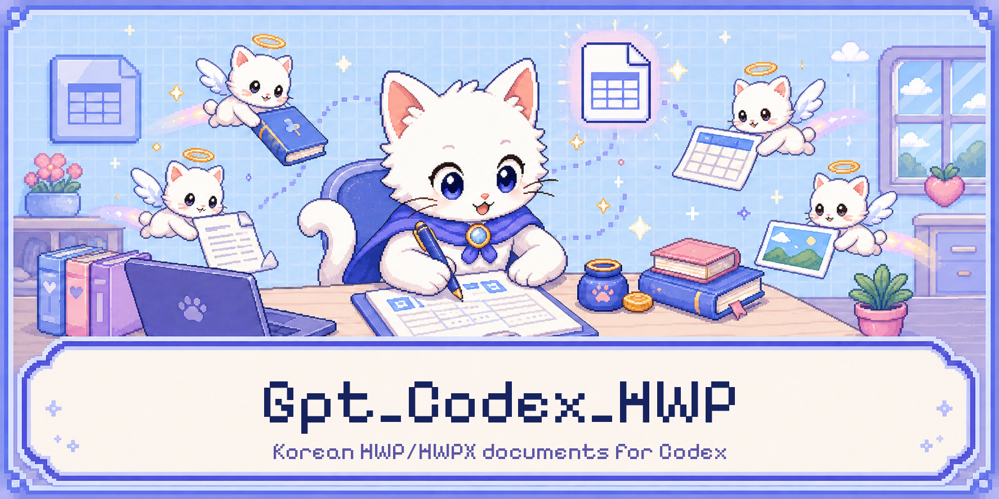

[한국어](README.md) | [English](README.en.md)

# Gpt_Codex_HWP

## 개요

Gpt_Codex_HWP는 Codex에서 한국어 HWP/HWPX 문서를 읽고, 만들고, 수정하고, 검증하고, 미리 보는 로컬 플러그인입니다. HWPX를 정식 쓰기 형식으로 사용하고 기존 HWPX의 원시 ZIP/XML 구조를 가능한 한 보존합니다. 바이너리 HWP는 형식 감지·읽기·미리보기 전용이며, 읽은 내용은 새 HWPX로 저장합니다.

## 기능

- Markdown에서 보고서, 계획서, 공문서, 회의록 등의 HWPX 생성
- 기존 HWPX의 구조 보존 텍스트 패치와 라벨 기반 양식 채우기
- 안전한 SVG/PNG 자산 생성과 HWPX 이미지 삽입
- HWP/HWPX 형식 감지, Markdown 읽기, 구조/글꼴 참조 검증, SVG 미리보기
- 보호 문서 거부, 출력 덮어쓰기 방지, 경로/ZIP 순회 방어
- 대용량 문서를 한 번만 파싱해 UTF-8 Markdown으로 저장한 뒤 안전하게 분할 읽기

## 형식 지원

| 형식 | 지원 범위 |
| --- | --- |
| HWPX | 읽기, 생성, 구조 보존 패치, 양식 채우기, 이미지 삽입, 검증, 미리보기 |
| HWP 5.x | 형식 감지, 읽기, 미리보기만 지원. 읽은 내용은 새 HWPX로 저장 |
| HWP 3.x | 실제 fixture 검증이 없어 지원을 보장하지 않음 |
| PDF, DOCX, XLSX 등 | Kordoc이 지원하는 범위에서 형식 감지와 읽기 |

HWPX는 이 프로젝트의 정식 작성 형식입니다. 바이너리 HWP를 수정하려면 먼저 `hwp_read`로 읽고, 필요한 내용을 Markdown으로 정리한 다음 `hwp_generate_hwpx`로 새로운 HWPX 경로에 저장하십시오.

## 요구 사항

- Node.js 22 이상
- Windows x64 또는 macOS Apple Silicon
- `after-paragraph` 이미지 삽입에는 PATH에서 실행 가능한 Python 3.10 이상
- Codex 플러그인 마켓플레이스 명령을 사용할 수 있는 환경

Python이 없으면 Python 기반 이미지 삽입 모드만 `PYTHON_NOT_FOUND`로 실패하며 다른 도구는 계속 사용할 수 있습니다.

## 첫 배포 전 주요 보완 사항

Gpt_Codex_HWP는 [Kordoc](https://github.com/chrisryugj/kordoc), [rhwp](https://github.com/edwardkim/rhwp), [hwpx-editing-skill](https://github.com/kangdacool/hwpx-editing-skill)과 여러 공개 오픈소스를 통합·적용하는 과정에서 확인한 문서 처리 경계 문제를 첫 배포 전에 보완했습니다. 이는 해당 원본 프로젝트들에 동일한 버그나 취약점이 존재한다는 뜻이 아닙니다. 기반 작업을 공개한 모든 유지관리자와 기여자께 감사드립니다.

- HWPX를 메모리에 적재하기 전에 ZIP 중앙 디렉터리의 실제 항목 수와 크기 예산을 검사합니다.
- 대소문자만 다른 보호 매니페스트 중복을 거부하고 UTF-8·UTF-16 보호 설정을 일관되게 탐지합니다.
- 문서·이미지 처리와 실제 최종 MCP 응답에 크기 제한을 적용합니다.
- 수정 결과를 의미 단위로 재검증하고 Python 앵커 탐색은 전체 일치 목록을 만들지 않고 순차 처리합니다.
- 공개 배포 메타데이터에서 개인 식별 흔적을 제거했습니다.

세부 참고 범위, 고정 버전, 저작권과 라이선스는 [`THIRD_PARTY_NOTICES.md`](THIRD_PARTY_NOTICES.md)를 확인하십시오.

## 개발 및 플랫폼 검증 상태

이 프로젝트는 Windows x64 환경을 중심으로 제작하고 실제 검증했습니다. macOS Apple Silicon 호환성을 고려해 런처와 런타임 경로를 구성했지만, 실제 Mac 기기 스모크 테스트는 아직 수행하지 않았습니다. 따라서 macOS Apple Silicon은 호환 대상이지만 현재 검증 완료된 플랫폼은 아닙니다.

## 에이전트를 통한 GitHub 설치

사용자는 Codex 에이전트에게 다음과 같이 요청할 수 있습니다.

> `Burntgogi/Gpt_Codex_HWP`의 `v0.1.2` 릴리스를 설치해 주세요. 이 절의 순서를 따르고 `installedPath`를 검증한 뒤 잠금 파일로 운영 의존성을 설치하고, 새 작업에서 MCP 도구 9개를 확인해 주세요.

1. Git, Codex CLI, Node.js 22 이상과 npm을 확인합니다. `after-paragraph` 이미지 삽입에만 Python 3.10 이상이 추가로 필요합니다.
2. 움직이는 `main` 대신 릴리스 태그를 고정해 마켓플레이스를 등록합니다.

```powershell
codex plugin marketplace add Burntgogi/Gpt_Codex_HWP --ref v0.1.2 --json
```

반환된 JSON의 `marketplaceName`이 `gpt-codex-hwp-local`인지 확인합니다.

3. 설치 결과를 JSON으로 받습니다.

```powershell
$installed = codex plugin add gpt-codex-hwp@gpt-codex-hwp-local --json | ConvertFrom-Json
$installedPath = [System.IO.Path]::GetFullPath([string]$installed.installedPath)
```

4. 설치 JSON의 `pluginId`가 `gpt-codex-hwp@gpt-codex-hwp-local`이고 `version`이 비어 있지 않은지 확인합니다. `installedPath`가 절대 경로이고 실제 디렉터리이며, 경로 끝이 `plugins/cache/gpt-codex-hwp-local/gpt-codex-hwp/<version>` 구조인지 확인합니다. 그 안에 `.codex-plugin/plugin.json`, `package.json`, `package-lock.json`, `dist/mcp.js`가 모두 있어야 합니다. JSON 문자열을 명령으로 평가하거나 예상 밖의 경로에서 npm을 실행하지 않습니다.
5. 검증한 정확한 경로에서 잠금 파일 기반 운영 의존성을 설치하고 감사합니다.

```powershell
Push-Location -LiteralPath $installedPath
try {
  npm ci --omit=dev
  if ($LASTEXITCODE -ne 0) { throw "npm ci failed" }
  npm audit --omit=dev
  if ($LASTEXITCODE -ne 0) { throw "npm audit failed" }
} finally {
  Pop-Location
}
```

6. Codex를 재시작하거나 새 작업을 열고 문서에 나열된 정확히 9개 도구(`hwp_detect_format`, `hwp_read`, `hwp_generate_hwpx`, `hwp_validate`, `hwp_render_preview`, `hwp_patch_document`, `hwp_fill_form`, `hwp_create_svg_asset`, `hwp_insert_image`)를 확인합니다. 실패하면 기존에 작동하는 플러그인을 제거하지 말고 오류와 `installedPath`만 보고합니다. 토큰, 환경 변수, 사용자 문서 내용은 보고하지 않습니다.

## 설치 및 마이그레이션

기존 설치에서 안전하게 전환하려면 다음 순서를 지키십시오.

1. 새 프로젝트 디렉터리에서 새 로컬 마켓플레이스를 등록합니다.
```powershell
cd Gpt_Codex_HWP
codex plugin marketplace add .
```

2. 새 플러그인을 설치합니다.
```powershell
codex plugin add gpt-codex-hwp@gpt-codex-hwp-local
```

이 명령만으로 npm 운영 의존성이 준비되지는 않습니다. 설치 결과의 검증된 런타임 경로에서 아래 `런타임 설치` 절의 `npm ci --omit=dev`를 실행하십시오.

3. 새 Codex 작업을 열어 `gpt-codex-hwp@gpt-codex-hwp-local` 플러그인 ID와 정확히 9개 도구(`hwp_detect_format`, `hwp_read`, `hwp_generate_hwpx`, `hwp_validate`, `hwp_render_preview`, `hwp_patch_document`, `hwp_fill_form`, `hwp_create_svg_asset`, `hwp_insert_image`)가 등록됐는지 확인합니다.

4. 새 설치 검증에 성공한 뒤에만 기존 플러그인을 제거합니다.
```powershell
codex plugin remove hwp-korean-docs@hwp-local
```

5. 새 설치 검증에 실패하면 이전 플러그인을 유지하고 새 설치만 제거한 뒤 다시 시도하십시오. 로컬 소스를 갱신한 뒤에는 manifest 버전 캐시버스터를 갱신하고 새 플러그인을 다시 설치해야 합니다.

## 도구

| 도구 | 용도 |
| --- | --- |
| `hwp_detect_format` | 파일의 실제 문서 형식과 컨테이너를 감지합니다. |
| `hwp_read` | HWP/HWPX를 Markdown과 메타데이터로 읽습니다. |
| `hwp_generate_hwpx` | Markdown에서 새 HWPX를 생성합니다. |
| `hwp_validate` | HWPX 구조와 글꼴 참조 무결성을 검사합니다. |
| `hwp_render_preview` | HWP/HWPX를 SVG 미리보기로 렌더링합니다. |
| `hwp_patch_document` | 기존 HWPX 구조를 보존하며 텍스트를 수정합니다. 바이너리 HWP는 `HWP_READ_ONLY`입니다. |
| `hwp_fill_form` | 라벨 기반 양식 값을 안전하게 채웁니다. |
| `hwp_create_svg_asset` | 안전한 SVG와 PNG 시각 자산을 생성합니다. |
| `hwp_insert_image` | 앵커를 기준으로 이미지를 HWPX에 삽입합니다. |

## 워크플로

새 문서는 `hwp_generate_hwpx`로 만든 뒤 `hwp_detect_format`, `hwp_validate`, `hwp_read`, `hwp_render_preview` 순서로 형식, 구조, 내용, 배치를 확인합니다.

기존 HWPX는 먼저 `hwp_read`로 읽고 블록 순서와 표 구조를 유지한 Markdown으로 `hwp_patch_document`를 호출합니다. 바이너리 HWP는 `hwp_read`로 읽은 뒤 `hwp_generate_hwpx`를 사용해 새 HWPX로 저장합니다. 양식은 `hwp_fill_form`, 그림은 `hwp_create_svg_asset`과 `hwp_insert_image`를 사용합니다. 일반 그림은 `after-paragraph`, 서명·도장은 `seal-anchor` 모드가 적합하며 앵커가 없거나 여러 개면 임의로 선택하지 않습니다.

## 대용량 문서 읽기

원본 문서의 하드 상한은 512 MiB입니다. 이는 외곽 안전 한도이며 모든 512 MiB 문서의 파싱 성공을 보장하지 않습니다. Kordoc 3.18.1은 현재 HWP/HWPX 전체 압축 해제량을 100 MiB, HWPX 항목 수를 500개로 제한하므로 더 엄격한 엔진 한도가 먼저 적용될 수 있습니다.

일반 `hwp_read`는 JavaScript 문자열 길이 기준 Markdown 64,000자까지 인라인으로 반환합니다. 더 큰 결과에는 기존 파일이 아닌 새 `.md` 경로를 `markdown_output_path`로 지정하십시오. 플러그인은 원본을 한 번만 파싱하고 전체 UTF-8 Markdown을 최대 256 MiB까지 저장하며, 응답에는 처음 64,000자와 전체 크기·원본 지문·권장 분할 크기를 반환합니다. 이후 Codex는 파생 Markdown을 약 64,000자 단위로 읽으므로 원본 문서를 반복 파싱하지 않습니다.

최종 직렬화 MCP 결과의 하드 상한 8 MiB는 별도로 유지됩니다. 원본 파일이 8 MiB를 넘으면 첫 읽기부터 `markdown_output_path`를 제공하고, 더 작은 원본도 `RESPONSE_TOO_LARGE`가 반환되면 새 `.md` 경로를 지정해 다시 읽으십시오.

## 안전

- 입력 경로와 출력 경로는 달라야 하며 기존 출력 파일을 덮어쓰지 않습니다.
- 서명, 암호화, DRM, 배포용 보호가 감지된 문서는 보호를 우회하지 않고 거부합니다.
- 경로 별칭, 하드링크, 심볼릭 링크, Windows junction, ZIP 경로 순회를 방어합니다.
- HWPX 검증에 실패하면 생성 또는 편집 결과물을 쓰지 않습니다.
- `hwp_patch_document`의 의미 검증은 필수이며 검증을 끄거나 검증 통계 없이 결과물을 게시할 수 없습니다.
- 보호 매니페스트는 UTF-8/UTF-16 인코딩을 구분해 검사하고, ZIP 엔트리 수는 JSZip 로드 전에 최대 10,000개로 제한합니다.
- 양식 값은 기본적으로 MCP 결과에서 마스킹하며 명시적 요청이 있을 때만 공개합니다.
- 바이너리 HWP 직접 패치는 `HWP_READ_ONLY`로 거부합니다.

## 글꼴 무결성

HWPX는 `HANGUL`, `LATIN`, `HANJA`, `JAPANESE`, `OTHER`, `SYMBOL`, `USER` 언어권마다 별도의 글꼴표를 사용합니다. 생성 과정은 존재하지 않는 참조만 유효한 ID로 정규화하며 Kordoc의 장평, 자간, 상대 크기, 글자 위치와 글꼴 이름은 바꾸지 않습니다. `hwp_validate`는 글꼴표의 중복/누락, 카운트, ID, 빈 이름과 잘못된 `fontRef`를 검사합니다.

이 플러그인은 글꼴 파일을 번들하거나 HWPX에 내장하지 않으며 시스템 글꼴을 자동 설치하지 않습니다. 실제 글꼴 표시와 줄바꿈은 문서를 여는 플랫폼에 설치된 글꼴에 따라 달라질 수 있습니다.

## 알려진 제한

- 바이너리 HWP는 읽기 전용이며 생성·수정·변환 출력은 모두 HWPX로 작성합니다.
- 원본 문서 상한은 512 MiB지만 Kordoc 3.18.1의 100 MiB 압축 해제량과 HWPX 500개 항목 제한 등 더 엄격한 엔진 한도가 적용될 수 있습니다.
- 인라인 Markdown은 64,000자, 파생 Markdown 파일은 256 MiB, 최종 직렬화 MCP 결과는 8 MiB로 제한합니다.
- Kordoc 또는 rhwp 미리보기는 한컴 GUI와 픽셀 단위로 동일하지 않을 수 있습니다.
- rhwp 미리보기 폴백은 첫 페이지만 렌더링하고 Node 환경의 근사 글꼴 폭을 사용할 수 있습니다.
- 보호 문서의 암호나 DRM을 해제하거나 우회하지 않습니다.
- HWP 3.x는 실제 fixture가 없어 검증된 지원으로 표시하지 않습니다.
- 미리보기 SVG는 128 MiB로 제한합니다.
- 미리보기 하이라이트는 최대 256개 및 합계 16,384자, 한 번의 양식 채우기 값은 합계 10,000개로 제한합니다.

## 런타임 설치

플랫폼별 네이티브 의존성은 각 런타임 환경에서 별도로 설치합니다. Windows에서 설치한 `node_modules`를 macOS로 복사하지 마십시오.

```bash
npm ci --omit=dev
```

이 명령은 잠금 파일을 사용해 Sharp를 포함한 런타임 의존성을 현재 OS와 CPU에 맞게 설치합니다. 글꼴 파일은 설치하지 않습니다.

## 오픈 소스 감사

이 프로젝트의 `hwpx-editing-skill` 사용은 일반 런타임 의존성과 다릅니다. 원시 항목과 압축 메타데이터를 보존하는 HWPX 재패키징 흐름, 일부 안전 원칙과 검증 흐름을 해당 프로젝트의 고정 커밋에서 수정·적용했습니다. 유지관리자와 기여자께 감사드립니다.

Kordoc에서는 문서 감지, 읽기, HWPX 생성/검증/미리보기 런타임을 사용했고, rhwp에서는 읽기 전용 문서 흐름을 위한 선택적 HWP/HWPX 파싱과 미리보기 폴백을 사용했습니다. Model Context Protocol TypeScript SDK는 MCP 서버와 stdio 전송을, xmldom은 XML DOM 처리를, SheetJS CFB는 바이너리 HWP의 OLE 복합 파일 처리를, JSZip은 HWPX ZIP 처리를, Sharp는 안전한 이미지 변환을, Zod는 도구 입력 스키마 검증을 제공합니다. 각 프로젝트의 유지관리자와 기여자께 감사드립니다.

Pixelify Sans는 최종 배너의 래스터화된 제목을 제작할 때만 사용했으며 글꼴 파일은 플러그인에 포함되지 않습니다. Pixelify Sans Project Authors와 Google Fonts 유지관리자께 감사드립니다. 정확한 버전, 저작권, 라이선스, 사용 범위는 [THIRD_PARTY_NOTICES.md](THIRD_PARTY_NOTICES.md)를 참조하십시오.

## 라이선스

Gpt_Codex_HWP 프로젝트는 [Apache-2.0](LICENSE)으로 배포됩니다. 제3자 구성 요소와 제작 입력물은 [THIRD_PARTY_NOTICES.md](THIRD_PARTY_NOTICES.md)에 기재된 각각의 라이선스를 따릅니다.
