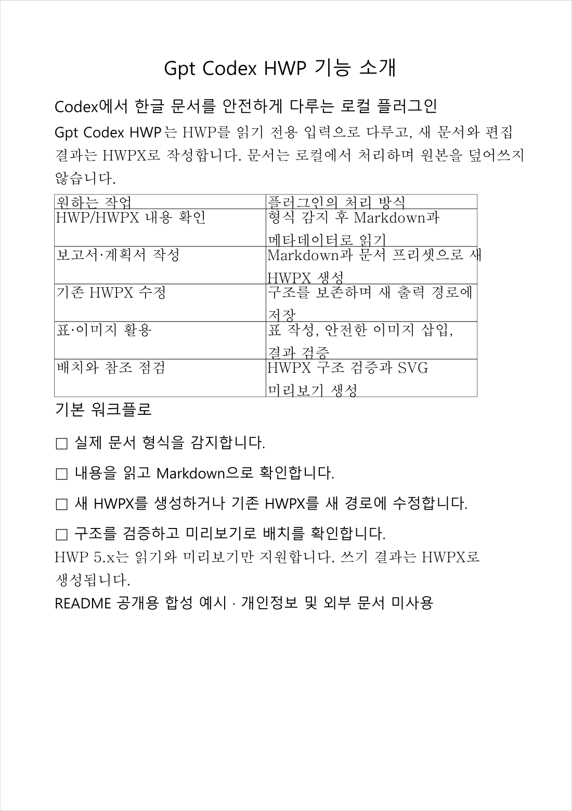

<p align="center">
  
</p>

<h1 align="center">Gpt_Codex_HWP</h1>

<p align="center"><strong>Codex에서 한글 HWP를 읽고, 검증 가능한 HWPX를 만드는 로컬 문서 플러그인</strong></p>

<p align="center">
  <a href="https://github.com/Burntgogi/Gpt_Codex_HWP/actions/workflows/ci.yml"></a>
  <a href="https://github.com/Burntgogi/Gpt_Codex_HWP/actions/workflows/security.yml"></a>
  
  
  <a href="LICENSE"></a>
</p>

<p align="center">
  <a href="README.md">한국어</a> ·
  <a href="README.en.md">English</a> ·
  <a href="#실제-hwpx-결과">결과 보기</a> ·
  <a href="#안정-버전-v025-github-설치">빠른 설치</a> ·
  <a href="#형식-지원">지원 범위</a> ·
  <a href="#안전">보안</a>
</p>

## 개요

Gpt_Codex_HWP는 Codex에서 한국어 HWP/HWPX 문서를 읽고, 만들고, 수정하고, 검증하고, 미리 보는 로컬 플러그인입니다. HWPX를 정식 쓰기 형식으로 사용하고 기존 HWPX의 원시 ZIP/XML 구조를 가능한 한 보존합니다. 바이너리 HWP는 형식 감지·읽기·미리보기 전용이며, 읽은 내용은 새 HWPX로 저장합니다.

## v0.2.5 릴리즈

`v0.2.5`는 `v0.2.2`에서 준비한 HWP 읽기 전용·HWPX 쓰기 원칙, 명시적 지속 런타임 설치와 one-shot 도구 9개를 그대로 유지합니다. hosted Windows에서 누적 테스트 실행이 불안정했던 릴리스 게이트를 루트 테스트 26개와 소스 테스트 41개의 정확한 전체 목록을 사용하는 파일별 제한·격리 실행으로 바꿨습니다. 목록 차이는 fail-closed로 거부하고, 실패 정보는 고정된 비공개 안전 영수증만 남기며, Windows 하위 프로세스 트리도 제한 시간 안에 종료·회수합니다. 테스트를 삭제하거나 검증 범위를 줄이지 않았고 `v0.2.4` 후보 대비 사용자 런타임·도구·문서 동작은 바뀌지 않았습니다. 개발과 실제 문서 검증은 Windows x64 기반으로 수행했으며, macOS Apple Silicon CI는 현재 HEAD의 성공 영수증으로만 판정합니다. 실제 Mac 기기의 Codex Desktop·한컴오피스 한글 사용은 아직 검증하지 않았습니다.

## 이전 릴리즈

`v0.2.3`과 `v0.2.4`는 불변 미게시 후보 태그이며, 어느 태그에도 GitHub Release나 배포 자산이 없습니다. `v0.2.2`는 HWP 읽기 전용·HWPX 쓰기, 기본 one-shot 실행과 100 MiB CI 검증 범위를 도입한 이전 공개 안정 릴리즈입니다. 자세한 이력은 [CHANGELOG](CHANGELOG.md)와 [한국어 릴리즈 노트](RELEASE_NOTES.md)에서 확인할 수 있습니다.

## 기능

- Markdown에서 보고서, 계획서, 공문서, 회의록 등의 HWPX 생성
- 기존 HWPX의 구조 보존 텍스트 패치와 라벨 기반 양식 채우기
- 안전한 SVG/PNG 자산 생성과 HWPX 이미지 삽입
- HWP/HWPX 형식 감지, Markdown 읽기, 구조/글꼴 참조 검증, SVG 미리보기
- 보호 문서 거부, 출력 덮어쓰기 방지, 경로/ZIP 순회 방어
- 대용량 문서를 한 번만 파싱해 UTF-8 Markdown으로 저장한 뒤 안전하게 분할 읽기

## 실제 HWPX 결과

아래 이미지는 README 공개용 합성 Markdown을 `hwp_generate_hwpx`의 `report` 프리셋으로 HWPX에 작성하고, 구조 검증을 통과한 문서를 SVG로 미리 본 뒤 PNG로 렌더링한 결과입니다. 개인정보, 사용자 문서, 외부 문서 내용은 사용하지 않았습니다.

<p align="center">
  
</p>

<p align="center"><sub>실제 생성 결과 · 1쪽 · 표 1개 · 검증 문제 0개 · 미리보기 경고 0개</sub></p>

## 형식 지원

| 형식 | 지원 범위 |
| --- | --- |
| HWPX | 읽기, 생성, 구조 보존 패치, 양식 채우기, 이미지 삽입, 검증, 미리보기 |
| HWP 5.x | 형식 감지, 읽기, 미리보기만 지원. 읽은 내용은 새 HWPX로 저장 |
| HWP 3.x | 실제 fixture 검증이 없어 지원을 보장하지 않음 |
| PDF, DOCX, XLSX 등 | 지원하지 않음. `hwp_read`는 Kordoc 파싱 전에 거부 |

HWPX는 이 프로젝트의 정식 작성 형식입니다. 바이너리 HWP를 수정하려면 먼저 `hwp_read`로 읽고, 필요한 내용을 Markdown으로 정리한 다음 `hwp_generate_hwpx`로 새로운 HWPX 경로에 저장하십시오.

## 요구 사항

- Node.js 22 이상
- Windows x64 또는 macOS Apple Silicon
- `after-paragraph` 이미지 삽입에는 PATH에서 실행 가능한 Python 3.10 이상
- Codex 플러그인 마켓플레이스 명령을 사용할 수 있는 환경

Python이 없으면 Python 기반 이미지 삽입 모드만 `PYTHON_NOT_FOUND`로 실패하며 다른 도구는 계속 사용할 수 있습니다.

## v0.1.4 배포 전 주요 보완 사항

Gpt_Codex_HWP는 [Kordoc](https://github.com/chrisryugj/kordoc), [rhwp](https://github.com/edwardkim/rhwp), [hwpx-editing-skill](https://github.com/kangdacool/hwpx-editing-skill)과 여러 공개 오픈소스를 통합·적용하는 과정에서 확인한 문서 처리 경계 문제를 첫 배포 전에 보완했습니다. 이는 해당 원본 프로젝트들에 동일한 버그나 취약점이 존재한다는 뜻이 아닙니다. 기반 작업을 공개한 모든 유지관리자와 기여자께 감사드립니다.

- HWPX를 메모리에 적재하기 전에 ZIP 중앙 디렉터리의 실제 항목 수와 크기 예산을 검사합니다.
- 대소문자만 다른 보호 매니페스트 중복을 거부하고 UTF-8·UTF-16 보호 설정을 일관되게 탐지합니다.
- 문서·이미지 처리와 실제 최종 MCP 응답에 크기 제한을 적용합니다.
- 수정 결과를 의미 단위로 재검증하고 Python 앵커 탐색은 전체 일치 목록을 만들지 않고 순차 처리합니다.
- 공개 배포 메타데이터에서 개인 식별 흔적을 제거했습니다.
- Kordoc 3.18.1 공식 아카이브를 고정 SHA-512로 인증하고 필요한 Core만 포함해 소스맵과 선택 의존성을 제거했습니다.
- 공개 배포물을 패킹하기 전에 개인정보 경로, 개인키, 실제 자격증명, `.env`, 테스트·사용자 문서가 없는지 검사합니다.

세부 참고 범위, 고정 버전, 저작권과 라이선스는 [`THIRD_PARTY_NOTICES.md`](THIRD_PARTY_NOTICES.md)를 확인하십시오.

## 개발 및 플랫폼 검증 상태

이 프로젝트는 주로 Windows x64에서 개발하고 실제 검증했습니다. macOS Apple Silicon 플러그인 런타임 CI는 구성되어 있지만, 현재 HEAD에 대한 성공 영수증이 확인되기 전에는 이 CI를 통과 또는 검증 완료로 표현하지 않습니다. 실제 macOS에서 Codex Desktop과 한컴오피스 한글을 사용하는 과정은 검증하지 않았습니다. 따라서 macOS는 호환 대상이며 macOS 완전 지원을 주장하지 않습니다.

`v0.1.4`는 Node 테스트 334개 중 330개 통과, 예상 플랫폼·권한 스킵 4개, 실패 0개와 Python 테스트 16/16, production audit 취약점 0개를 확인했습니다. 자세한 결과는 [v0.1.4 GitHub 릴리즈](https://github.com/Burntgogi/Gpt_Codex_HWP/releases/tag/v0.1.4)를 참조하십시오.

## 안정 버전 v0.2.5 GitHub 설치

`v0.2.5`는 현재 권장 공개 릴리즈입니다. `v0.1.0`부터 `v0.2.2`까지는 과거 릴리스로 유지됩니다. `v0.2.3`과 `v0.2.4`는 릴리스 검증 이식성 문제를 바로잡는 동안 불변 태그로만 보존한 미게시 후보이며 GitHub Release와 배포 자산은 없습니다. `v0.2.0`도 게시 전에 철회된 후보입니다. 새 설치는 `v0.2.5` 태그를 사용하고 [릴리즈 노트](RELEASE_NOTES.md)를 먼저 확인하십시오.

사용자는 Codex 에이전트에게 다음과 같이 요청할 수 있습니다.

> `Burntgogi/Gpt_Codex_HWP`의 최신 공개 릴리스 `v0.2.5`를 설치해 주세요. 이 절의 순서를 따르고 `installedPath`를 검증한 뒤 명시적 런타임 설치기와 `doctor`를 실행하세요. 실행 중인 모든 Codex CLI와 Desktop 호스트를 한 번 닫았다가 다시 열고 `/mcp`에 기본 `gpt-codex-hwp`가 등록되지 않는지와 문서 작업 후 one-shot 프로세스가 종료되는지 확인해 주세요.

1. Git, Codex CLI, Node.js 22 이상과 npm을 확인합니다. `after-paragraph` 이미지 삽입에만 Python 3.10 이상이 추가로 필요합니다.
2. 움직이는 `main` 대신 릴리스 태그를 고정해 마켓플레이스를 등록합니다.

```powershell
codex plugin marketplace add Burntgogi/Gpt_Codex_HWP --ref v0.2.5 --json
```

반환된 JSON의 `marketplaceName`이 `gpt-codex-hwp-local`인지 확인합니다.

3. 설치 결과를 JSON으로 받습니다.

```powershell
$installed = codex plugin add gpt-codex-hwp@gpt-codex-hwp-local --json | ConvertFrom-Json
$installedPath = [System.IO.Path]::GetFullPath([string]$installed.installedPath)
```

4. 설치 JSON의 `pluginId`가 `gpt-codex-hwp@gpt-codex-hwp-local`이고 `version`이 비어 있지 않은지 확인합니다. `installedPath`가 절대 경로이고 실제 디렉터리이며, 경로 끝이 `plugins/cache/gpt-codex-hwp-local/gpt-codex-hwp/<version>` 구조인지 확인합니다. 이번 릴리스의 전체 플러그인 버전은 `0.2.5+codex.20260809232847`입니다. 런타임에는 `.codex-plugin/plugin.json`, `runtime-manifest.json`, `package.json`, `package-lock.json`, `dist/install-runtime.js`, `dist/runtime-bootstrap.js`, `dist/doctor.js`, `dist/oneshot.js`, `dist/mcp.js`, `examples/oneshot-tool-schemas.json`, `examples/mcp-manual.json`이 모두 있어야 하고, `.codex-plugin/plugin.json`의 `skills`는 `./skills/`이며 `mcpServers` 속성은 없어야 합니다. JSON 문자열을 명령으로 평가하거나 예상 밖의 경로에서 npm을 실행하지 않습니다.
5. 검증한 정확한 경로에서 플랫폼 런타임을 설치하고 진단합니다. Windows x64에서 설치된 운영 의존성은 64 MiB 이하인지 확인합니다.

```powershell
Push-Location -LiteralPath $installedPath
try {
  $runtime = node dist/install-runtime.js --json | ConvertFrom-Json
  if ($LASTEXITCODE -ne 0 -or $runtime.code -ne "RUNTIME_INSTALL_OK") { throw "runtime installation failed" }
  node dist/doctor.js --json
  if ($LASTEXITCODE -ne 0) { throw "doctor found a required failure" }
} finally {
  Pop-Location
}
```

6. `doctor`는 진단 전용이며 설치나 복구를 수행하지 않고 MCP 도구가 아닙니다. JSON에는 안전한 상태 코드, 불리언, 버전과 개수만 포함되며 Python·rhwp·고정 테스트 fixture 같은 선택 기능의 부재는 필수 실패와 분리됩니다.
7. 실행 중인 모든 Codex CLI와 Desktop 호스트를 한 번 닫았다가 다시 여십시오. 새 작업만으로는 충분하지 않습니다. 플러그인과 스킬이 보이고 `/mcp`에 `gpt-codex-hwp`가 기본 등록되지 않는지 확인합니다. `RUNTIME_NOT_INSTALLED`가 나오면 문서 작업을 반복하지 말고 검증한 경로에서 설치기를 다시 실행합니다. HWP/HWPX 작업 하나가 성공했는지 확인하고 생성 결과를 검증한 뒤 one-shot 프로세스와 하위 프로세스 종료를 확인합니다. worker-only·child-only·mixed 종료 영수증과 감독된 나머지 프로세스 트리 0개가 검증 대상입니다. Windows x64, Linux lifecycle, macOS arm64와 Security policy hosted 검사는 최종 후보에서 통과했지만 실제 Mac 사용은 미검증입니다. 실패하면 기존에 작동하는 플러그인을 제거하지 말고 오류와 `installedPath`만 보고합니다. 토큰, 환경 변수, 사용자 문서 내용은 보고하지 않습니다.

## 설치 및 마이그레이션

기존 설치에서 안전하게 전환하려면 다음 순서를 지키십시오.

1. 새 프로젝트 디렉터리에서 새 로컬 마켓플레이스를 등록합니다.
```powershell
cd Gpt_Codex_HWP
codex plugin marketplace add .
```

2. 새 플러그인을 설치합니다.
```powershell
codex plugin add gpt-codex-hwp@gpt-codex-hwp-local
```

이 명령만으로 운영 의존성이 준비되지는 않습니다. 설치 결과의 검증된 `installedPath`에서 `node dist/install-runtime.js --json`을 실행하고 `RUNTIME_INSTALL_OK`를 확인하십시오.

3. 실행 중인 모든 Codex CLI와 Desktop 호스트를 한 번 닫았다가 다시 여십시오. 새 작업만으로는 충분하지 않습니다. `gpt-codex-hwp@gpt-codex-hwp-local` 플러그인과 스킬은 보여야 하지만 `/mcp`에 `gpt-codex-hwp`가 기본 등록되면 안 됩니다. 스킬로 문서 작업 하나를 실행해 1회 실행 프로세스가 종료되는지 확인합니다.

4. 새 설치 검증에 성공한 뒤에만 기존 플러그인을 제거합니다.
```powershell
codex plugin remove hwp-korean-docs@hwp-local
```

5. 새 설치 검증에 실패하면 이전 플러그인을 유지하고 새 설치만 제거한 뒤 다시 시도하십시오. 로컬 소스를 갱신한 뒤에는 manifest 버전 캐시버스터를 갱신하고 새 플러그인을 다시 설치해야 합니다.

### v0.2.2로 롤백

먼저 실행 중인 모든 Codex CLI와 Desktop 호스트를 완전히 종료한 뒤 다음 순서로 공개 `v0.2.2` 태그를 다시 설치합니다.

```powershell
codex plugin remove gpt-codex-hwp@gpt-codex-hwp-local --json
codex plugin marketplace remove gpt-codex-hwp-local --json
codex plugin marketplace add Burntgogi/Gpt_Codex_HWP --ref v0.2.2 --json
$installed = codex plugin add gpt-codex-hwp@gpt-codex-hwp-local --json | ConvertFrom-Json
```

반환된 `version`과 `installedPath`가 v0.2.2의 실제 설치 디렉터리를 가리키는지 검증하고, 공개 v0.2.2 안내의 잠금 파일 설치·doctor·문서 스모크를 완료하십시오. 롤백 성공이 확인되기 전에는 새 런타임을 지우지 마십시오. 성공 후에만 더 이상 사용하지 않는 정확한 `0.2.5+codex.20260809232847` 지속 런타임 디렉터리를 확인해 수동으로 제거합니다.

## 지속 런타임 저장과 제거

v0.2.5의 운영 의존성은 Codex 관리 캐시가 아니라 `$CODEX_HOME/plugin-runtime-data/gpt-codex-hwp/<전체-플러그인-버전>/<platform>-<arch>-node<Node-주버전>`에 저장됩니다. 예를 들어 Windows x64의 Node.js 22 런타임 키는 `win32-x64-node22`입니다. 같은 Codex 프로필에서도 Node 주버전별 런타임은 서로 교체하지 않고 공존합니다.

현재 Windows x64 검증에서 런타임 하나는 약 47~51 MiB였지만 플랫폼과 npm에 따라 달라질 수 있습니다. 플러그인 제거가 이 캐시 밖의 데이터를 자동으로 지운다고 가정하지 마십시오. 정리할 때는 모든 Codex CLI와 Desktop 호스트를 완전히 종료하고, 더 이상 사용하지 않는 정확한 `<전체-플러그인-버전>` 디렉터리만 확인해 수동으로 제거하십시오. 모든 Gpt_Codex_HWP 버전을 제거한 경우에만 상위 `gpt-codex-hwp` 런타임 데이터 디렉터리 전체를 제거할 수 있습니다. 나중에 다시 설치하면 검증된 `installedPath`에서 `node dist/install-runtime.js --json`을 실행해 런타임을 재생성합니다.

## 기본 1회 실행과 수동 MCP 호환

기본 설치는 스킬이 각 작업마다 `dist/oneshot.js`를 한 번 호출합니다. 사용하지 않을 때는 Gpt_Codex_HWP 상주 Node 프로세스가 없고, 호출은 기존 9개 도구 계약 중 하나만 실행한 뒤 종료됩니다. 요청·응답 JSON은 문서 내용을 명령줄에 싣지 않으며 새 응답 파일만 배타적으로 만듭니다.

`dist/mcp.js`와 `npm start`는 기존 stdio MCP 호환을 위해 남아 있지만 자동 등록되지 않습니다. 영구 MCP가 필요한 사용자만 `examples/mcp-manual.json`을 명시적으로 복사·등록하십시오. 이 모드는 Codex 작업이나 호스트마다 별도의 Node 서버가 상주할 수 있습니다.

## 도구

| 도구 | 용도 |
| --- | --- |
| `hwp_detect_format` | 파일의 실제 문서 형식과 컨테이너를 감지합니다. |
| `hwp_read` | HWP/HWPX를 Markdown과 메타데이터로 읽습니다. |
| `hwp_generate_hwpx` | Markdown에서 새 HWPX를 생성합니다. |
| `hwp_validate` | HWPX 구조와 글꼴 참조 무결성을 검사합니다. |
| `hwp_render_preview` | HWP/HWPX를 SVG 미리보기로 렌더링합니다. |
| `hwp_patch_document` | 기존 HWPX 구조를 보존하며 텍스트를 수정합니다. 바이너리 HWP는 `HWP_READ_ONLY`입니다. |
| `hwp_fill_form` | 라벨 기반 양식 값을 안전하게 채웁니다. |
| `hwp_create_svg_asset` | 안전한 SVG와 PNG 시각 자산을 생성합니다. |
| `hwp_insert_image` | 앵커를 기준으로 이미지를 HWPX에 삽입합니다. |

## 워크플로

새 문서는 `hwp_generate_hwpx`로 만든 뒤 `hwp_detect_format`, `hwp_validate`, `hwp_read`, `hwp_render_preview` 순서로 형식, 구조, 내용, 배치를 확인합니다.

기존 HWPX는 먼저 `hwp_read`로 읽고 블록 순서와 표 구조를 유지한 Markdown으로 `hwp_patch_document`를 호출합니다. 바이너리 HWP는 `hwp_read`로 읽은 뒤 `hwp_generate_hwpx`를 사용해 새 HWPX로 저장합니다. 양식은 `hwp_fill_form`, 그림은 `hwp_create_svg_asset`과 `hwp_insert_image`를 사용합니다. 일반 그림은 `after-paragraph`, 서명·도장은 `seal-anchor` 모드가 적합하며 앵커가 없거나 여러 개면 임의로 선택하지 않습니다.

## 대용량 문서 읽기

형식과 구조가 유효한 원본 문서 중 100 MiB 이하 파일은 CI 검증 지원 범위입니다. 다만 비정상·손상 아카이브, 압축 해제 및 자원 정책, 선택적 허용 루트 정책에 따라 크기와 무관하게 거부될 수 있습니다. 100 MiB 초과 512 MiB 이하 문서는 최선 노력(best-effort) 범위로 호환성을 보장하지 않으며, 512 MiB 초과 파일은 거부합니다. Kordoc 3.18.1은 현재 HWP/HWPX 전체 압축 해제량을 100 MiB, HWPX 항목 수를 500개로 제한하므로 더 엄격한 엔진 한도가 먼저 적용될 수 있습니다.

일반 `hwp_read`는 JavaScript 문자열 길이 기준 Markdown 64,000자까지 인라인으로 반환합니다. 더 큰 결과에는 기존 파일이 아닌 새 `.md` 경로를 `markdown_output_path`로 지정하십시오. 플러그인은 원본을 한 번만 파싱하고 전체 UTF-8 Markdown을 최대 256 MiB까지 저장하며, 응답에는 처음 64,000자와 전체 크기·원본 지문·권장 분할 크기를 반환합니다. 이후 Codex는 파생 Markdown을 약 64,000자 단위로 읽으므로 원본 문서를 반복 파싱하지 않습니다.

최종 직렬화 MCP 결과의 하드 상한 8 MiB는 별도로 유지됩니다. 원본 파일이 8 MiB를 넘으면 첫 읽기부터 `markdown_output_path`를 제공하고, 더 작은 원본도 `RESPONSE_TOO_LARGE`가 반환되면 새 `.md` 경로를 지정해 다시 읽으십시오.

## 안전

취약점은 공개 이슈에 비밀·개인 문서·개인정보를 첨부하지 말고 [SECURITY.md](https://github.com/Burntgogi/Gpt_Codex_HWP/blob/main/SECURITY.md)의 GitHub 비공개 신고 절차를 이용하십시오. 문서 내용과 격리 수준을 포함한 정확한 신뢰 모델은 [보안 경계](https://github.com/Burntgogi/Gpt_Codex_HWP/blob/main/docs/SECURITY-BOUNDARIES.md)에 설명되어 있습니다.

### 선택적 문서 루트 제한

`GPT_CODEX_HWP_ALLOWED_ROOTS`를 설정하면 9개 MCP 도구가 사용하는 모든 사용자 입력·출력 경로를 지정한 로컬 디렉터리 안으로 제한할 수 있습니다. 설정하지 않으면 이전 버전과 같이 현재 OS 사용자가 접근할 수 있는 로컬 경로를 사용합니다. 값은 비어 있지 않은 JSON 배열이어야 하며, 각 항목은 이미 존재하는 고유한 절대 디렉터리여야 합니다. 심볼릭 링크나 Windows junction/reparse 별칭 자체는 루트로 사용할 수 없습니다. 아래 값은 정확한 JSON 문자열 예시입니다.

```powershell
$env:GPT_CODEX_HWP_ALLOWED_ROOTS = '["C:\\Documents\\HWP","D:\\TeamDocs"]'
```

```bash
export GPT_CODEX_HWP_ALLOWED_ROOTS='["/Volumes/TeamDocs"]'
```

빈 배열, 잘못된 JSON, 상대 경로, 중복 루트, 존재하지 않는 루트, 파일 또는 링크 루트가 있으면 MCP 서버가 시작 단계에서 닫힌 상태로 실패합니다. 값은 UTF-8 기준 16,384바이트, 루트 32개, 항목당 4,096자로 제한됩니다. 설정된 경우 원본 HWP/HWPX, Markdown·이미지 입력, 생성·패치·양식·이미지 삽입 HWPX, Markdown·SVG·PNG·미리보기·추출 이미지와 출력 디렉터리 모두 실경로 확인 뒤 같은 정책을 적용합니다. 거부 결과는 `PATH_OUTSIDE_ALLOWED_ROOTS`만 반환하며 설정값이나 거부된 절대 경로를 노출하지 않습니다.

대용량 처리용 내부 스풀은 사용자 루트 설정을 받지 않는 별도의 예측 불가능한 OS 임시 디렉터리에 소유자 전용 권한으로 만들고, 자식 프로세스에는 상속된 핸들만 전달하며 `finally`에서 제거합니다. 따라서 스풀은 사용자 허용 루트의 예외가 아니라 독립된 내부 신뢰 영역입니다. `allowed_roots`는 에이전트의 실수나 경로 이탈을 줄이는 방어선이며, 같은 OS 사용자 권한으로 실행되는 악성 프로세스를 완전히 격리하지는 못합니다. Node.js는 모든 파일시스템에서 Linux `openat2`나 Windows 핸들 상대 경로와 같은 원자적 보장을 이식성 있게 제공하지 않으므로, 높은 위험의 문서는 별도 저권한 계정·VM·컨테이너 같은 OS 격리에서 처리하십시오.

- 입력 경로와 출력 경로는 달라야 하며 기존 출력 파일을 덮어쓰지 않습니다.
- 서명, 암호화, DRM, 배포용 보호가 감지된 문서는 보호를 우회하지 않고 거부합니다.
- 경로 별칭, 하드링크, 심볼릭 링크, Windows junction, ZIP 경로 순회를 방어합니다.
- HWPX 검증에 실패하면 생성 또는 편집 결과물을 쓰지 않습니다.
- `hwp_patch_document`의 의미 검증은 필수이며 검증을 끄거나 검증 통계 없이 결과물을 게시할 수 없습니다.
- 보호 매니페스트는 UTF-8/UTF-16 인코딩을 구분해 검사하고, ZIP 엔트리 수는 JSZip 로드 전에 최대 10,000개로 제한합니다.
- 양식 값은 기본적으로 MCP 결과에서 마스킹하며 명시적 요청이 있을 때만 공개합니다.
- 바이너리 HWP 직접 패치는 `HWP_READ_ONLY`로 거부합니다.

## 글꼴 무결성

HWPX는 `HANGUL`, `LATIN`, `HANJA`, `JAPANESE`, `OTHER`, `SYMBOL`, `USER` 언어권마다 별도의 글꼴표를 사용합니다. 생성 과정은 존재하지 않는 참조만 유효한 ID로 정규화하며 Kordoc의 장평, 자간, 상대 크기, 글자 위치와 글꼴 이름은 바꾸지 않습니다. `hwp_validate`는 글꼴표의 중복/누락, 카운트, ID, 빈 이름과 잘못된 `fontRef`를 검사합니다.

이 플러그인은 글꼴 파일을 번들하거나 HWPX에 내장하지 않으며 시스템 글꼴을 자동 설치하지 않습니다. 실제 글꼴 표시와 줄바꿈은 문서를 여는 플랫폼에 설치된 글꼴에 따라 달라질 수 있습니다.

## 알려진 제한

- 바이너리 HWP는 읽기 전용이며 생성·수정·변환 출력은 모두 HWPX로 작성합니다.
- 유효한 원본 문서는 100 MiB 이하까지 CI 검증 범위이며, 100 MiB 초과 512 MiB 이하는 비보장 best-effort, 512 MiB 초과는 거부됩니다. 비정상 아카이브, 압축 해제·자원·허용 루트 정책과 Kordoc 3.18.1의 100 MiB 압축 해제량 및 HWPX 500개 항목 제한은 별도로 적용됩니다.
- 인라인 Markdown은 64,000자, 파생 Markdown 파일은 256 MiB, 최종 직렬화 MCP 결과는 8 MiB로 제한합니다.
- Kordoc 또는 rhwp 미리보기는 한컴 GUI와 픽셀 단위로 동일하지 않을 수 있습니다.
- rhwp 미리보기 폴백은 첫 페이지만 렌더링하고 Node 환경의 근사 글꼴 폭을 사용할 수 있습니다.
- 보호 문서의 암호나 DRM을 해제하거나 우회하지 않습니다.
- HWP 3.x는 실제 fixture가 없어 검증된 지원으로 표시하지 않습니다.
- 미리보기 SVG는 128 MiB로 제한합니다.
- 미리보기 하이라이트는 최대 256개 및 합계 16,384자, 한 번의 양식 채우기 값은 합계 10,000개로 제한합니다.

## 런타임 설치

플랫폼별 네이티브 의존성은 검증한 플러그인 `installedPath`에서 명시적 설치기로 준비합니다. Windows에서 설치한 런타임을 macOS로 복사하지 마십시오.

```bash
node dist/install-runtime.js --json
node dist/doctor.js --json
```

첫 명령의 JSON `code`는 `RUNTIME_INSTALL_OK`여야 합니다. 설치기는 잠금 파일과 매니페스트를 검증하고 lifecycle script를 끈 채 Sharp를 포함한 운영 의존성을 현재 OS와 CPU에 맞게 Codex 관리 캐시 밖에 원자적으로 게시합니다. 두 번째 명령은 설치나 복구 없이 환경을 진단합니다. 문서 작업 중에는 설치하지 않으며, `RUNTIME_NOT_INSTALLED`가 반환되면 이 절의 설치기를 명시적으로 실행하십시오. 글꼴 파일은 설치하지 않습니다. Kordoc Core는 HWP/HWPX 작업에 필요한 고정 런타임만 제공하며 PDF, OCR, ONNX, 수식 엔진 선택 의존성을 설치하지 않습니다. 검증된 Windows x64 런타임 의존성 예산은 64 MiB 이하입니다.

## 오픈 소스 감사

이 프로젝트의 `hwpx-editing-skill` 사용은 일반 런타임 의존성과 다릅니다. 원시 항목과 압축 메타데이터를 보존하는 HWPX 재패키징 흐름, 일부 안전 원칙과 검증 흐름을 해당 프로젝트의 고정 커밋에서 수정·적용했습니다. 유지관리자와 기여자께 감사드립니다.

Kordoc에서는 문서 감지, 읽기, HWPX 생성/검증/미리보기 런타임을 사용했고, rhwp에서는 읽기 전용 문서 흐름을 위한 선택적 HWP/HWPX 파싱과 미리보기 폴백을 사용했습니다. Model Context Protocol TypeScript SDK는 MCP 서버와 stdio 전송을, xmldom은 XML DOM 처리를, SheetJS CFB는 바이너리 HWP의 OLE 복합 파일 처리를, JSZip은 HWPX ZIP 처리를, Sharp는 안전한 이미지 변환을, Zod는 도구 입력 스키마 검증을 제공합니다. 각 프로젝트의 유지관리자와 기여자께 감사드립니다.

Pixelify Sans는 최종 배너의 래스터화된 제목을 제작할 때만 사용했으며 글꼴 파일은 플러그인에 포함되지 않습니다. Pixelify Sans Project Authors와 Google Fonts 유지관리자께 감사드립니다. 정확한 버전, 저작권, 라이선스, 사용 범위는 [THIRD_PARTY_NOTICES.md](THIRD_PARTY_NOTICES.md)를 참조하십시오.

## 라이선스

Gpt_Codex_HWP 프로젝트는 [Apache-2.0](LICENSE)으로 배포됩니다. 제3자 구성 요소와 제작 입력물은 [THIRD_PARTY_NOTICES.md](THIRD_PARTY_NOTICES.md)에 기재된 각각의 라이선스를 따릅니다.

## 기여 및 저장소 운영

공개 이슈와 풀 리퀘스트에서의 논의는 환영합니다. 공식 브랜치, 태그,
릴리스, 벤더 런타임, 생성 런타임의 변경은 저장소 소유자가 검토하고 직접
작성하며, 의존성 자동화는 이슈를 통한 권고만 수행합니다. 먼저
[기여 지침](https://github.com/Burntgogi/Gpt_Codex_HWP/blob/main/CONTRIBUTING.md)을 읽고 [아키텍처](https://github.com/Burntgogi/Gpt_Codex_HWP/blob/main/docs/ARCHITECTURE.md)의
원본과 생성 런타임 경계 및 [변경 기록](https://github.com/Burntgogi/Gpt_Codex_HWP/blob/main/CHANGELOG.md)을 확인하십시오.
자격증명, 개인 문서, 환경 파일, 개인 경로, 미공개 감사 자료는 공개 보고에
포함하지 않습니다. 보안 문제는 [SECURITY.md](https://github.com/Burntgogi/Gpt_Codex_HWP/blob/main/SECURITY.md)의 비공개 절차로
신고합니다.
